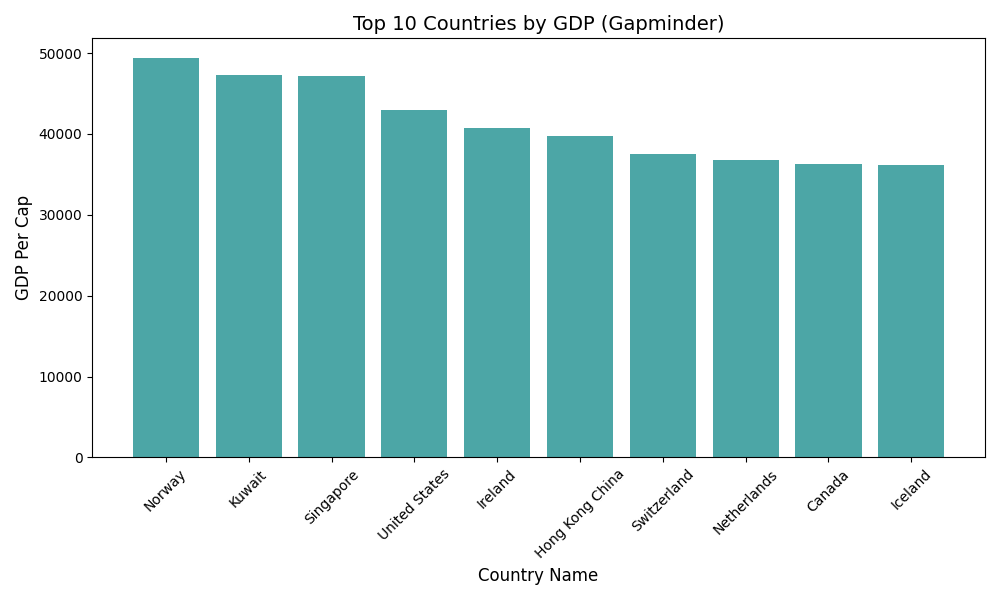

# GDP Data Analysis Project
Name:Md Rakibul Islam
id:24-59143-3

---

###  Overview
A Python-based data analysis tool that fetches global GDP data, processes it with **Pandas** & **NumPy**, and visualizes the results using **Matplotlib**.

###
Python(Core)
Pandas(Data Cleaning)
NumPy(Analytics)
Matplotlib (Visualization)

### Results

